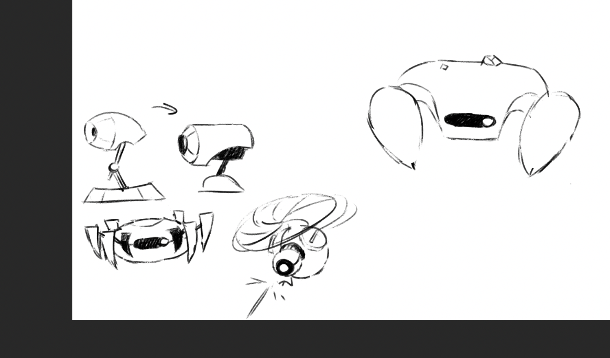
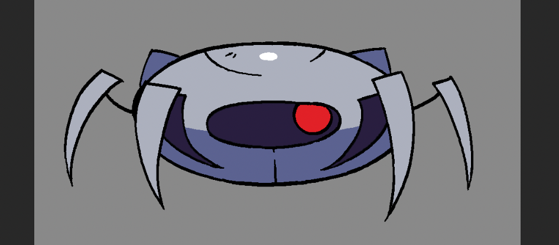
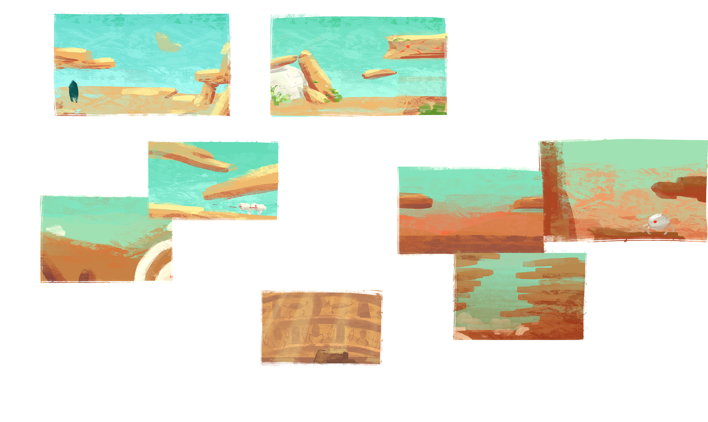

# Game Elements:

## Feels:
- Eerie
- Vastness / Void / Loneliness
- 

## Actions:
- movement
- jump
- dash
- shoot

-----

## Enemies:
- Small Crab
    - Beginner enemy;
    - Walks always forward (reversing direction when hitting a wall);
    - contact damage;
    - easy to kill swarms with dash; hard to kill with Shoot;
    - More likely to drop movement and dash ability;
- Patrol Drone
    - easy to kill with Shoot;
    - More likely to drop jump ability;
- Turret
    - hard to kill with Dash, easy to kill with Shoot;
    - More likely to drop shooting ability;
- Large Crab (tentative)
    - hard to kill with Dash, hard to kill with Jump;
    - Drops a random ability that the player is missing;

## Events:
- gain ability
- drop ability
    - by taking damage;
- gain debuff   (delayed)
    - by taking damage;
- drop debuff   (delayed)
- winning condition
    - Reach final level end zone? Get all abilities?
- game over condition and restart
    - Lose all abilities
    - Get stuck with not enough abilities to escape?

## Player status UI/VFX
- teclas
- damage taken feedback
- Ability help text?
- Ability telegraph?

## VFX
- damage done feedback
- ambient effects?

-----

## Levels: 
- Platform prefabs 
- Obstacles/challenges: (Motor coordination / reactive)
    - doors? 
    - traps?
    - puzzles?
- Visuals:
    - Parallax?
- Levels:
    - Level 1
    - NPC ability exchange Level
    - Level 2

## Character animation:
- shooting direction

## Other:
- main menu
- pause menu
