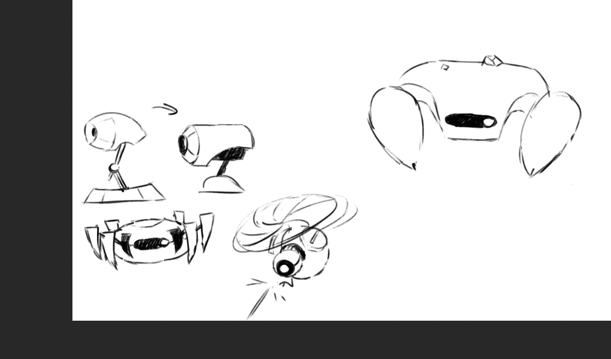
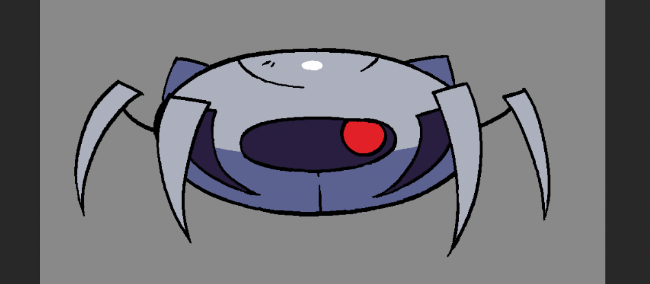

# Game Elements:

## Actions:
- movement
- jump
- dash
- shoot

-----

## Enemies:
- Small Crab
    - Walks always forward (reversing direction when hitting a wall);
    - contact damage;
- Patrol Drone
    - Shoots a projectile;

## Events:
- gain ability
- drop ability
    - by taking damage;
- game over condition and restart
    - Lose all abilities

